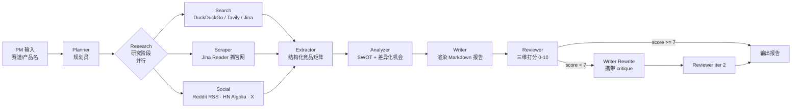
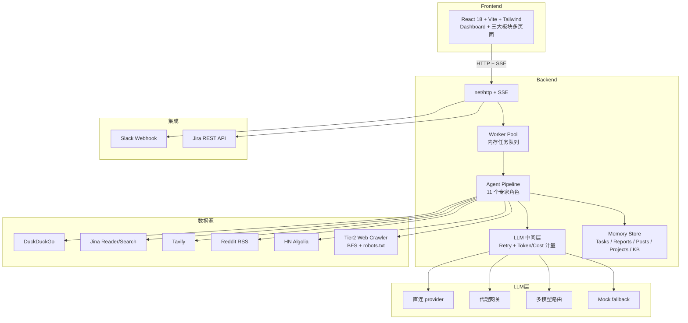

<div align="center">
  

  <h1>PM Agent Team</h1>

  <p><strong>面向产品经理的多 Agent 调研自动化平台</strong></p>

  <p>竞品调研 · 访谈分析 · PRD 起草 · 社区聆听 —— 将以天计的重复调研工作压缩到分钟级</p>

  <p>
    
    
    
    
    
    
    
  </p>

  
</div>

---

## 项目定位

SaaS 团队的产品经理有大量工时消耗在结构重复、信息密集的调研工作上。PM Agent Team 用多 Agent 流水线把这类工作自动化：

| 工作场景 | 人工耗时 | 本系统 |
|---|---|---|
| **竞品调研** — 横向扫描赛道、抓取官网、汇总用户口碑、产出对比矩阵 | 单次 1–3 天 | 搜索 / 抓取 / 社聆 Agent 并行执行，分钟级产出带引用的结构化报告 |
| **用户访谈分析** — 转写打标、主题聚类、需求提取 | 10 场访谈约 1 周 | 自动主题聚类 + 频次统计 + 原话引用 + 带置信度的需求列表 |
| **PRD 起草** — 背景、目标、用户故事、验收标准 | 单份 0.5–1 天 | 一句话需求生成结构化 PRD 草稿，含用户故事与验收标准 |
| **社区聆听** — 跟踪 Reddit / Hacker News / X 等平台的真实用户声量 | 通常无人力覆盖 | 跨平台批量抓取（1000+ 帖/任务）+ 相关性过滤 + 洞察聚类 |

### 与「LLM 套壳」的区别

- **多 Agent 协作流水线**：规划 → 搜索 / 抓取 / 社聆（并行）→ 结构化 → 分析 → 撰写 → 复审打分，复审分数低于阈值时携带 critique 自动重写一轮（self-correction loop）
- **角色化专家集群**：11 个具名专家角色（用户研究员、市场情报分析师、精益教练、风险审计师等），按场景动态出场
- **跨任务长期记忆**：项目空间（Project）聚合相关任务，新任务自动召回历史调研作为上下文
- **增量追问执行**：报告完成后追问（如「再补充一家竞品」）会派生 child task，完成后自动合并回 parent 报告
- **成本可观测**：内置 token / 成本追踪，per-task / per-agent / per-model 归因，支持任务预算上限
- **错误恢复**：LLM 调用三次指数退避重试（区分瞬时与永久错误）；非关键 Agent 失败仅告警、不阻塞主流程
- **工具链集成**：Slack 卡片推送、Jira issue 创建、Jira webhook 反向触发 PRD 起草

---

## 界面


> 多页面布局：Dashboard 工作流总览 + 需求分析 / 竞品调研 / 需求验证三大板块。各板块页内展示任务列表、Agent 实时协作流（中文叙事）、报告预览、复审评分与追问入口。交互式架构图见 [`assets/architecture.html`](./assets/architecture.html)。

---

## 技术架构

### 多 Agent 编排（竞品调研流水线为例）



### 系统架构



### 技术选型

| 层 | 选型 | 理由 |
|---|---|---|
| **后端语言** | Go 1.22+，标准库 net/http | goroutine 天然适配多 Agent 并发；零额外中间件 |
| **LLM 接入** | 多 provider 抽象层（直连 / 代理网关 / 多模型路由 / mock 兜底） | provider 通过环境变量切换，零代码改动；未配置 key 时自动降级 mock 模式 |
| **LLM 可靠性** | RetryClient（3 次指数退避，区分瞬时 / 永久错误）+ MeteredClient（token / 成本计量） | 调用链 raw → Retry → Metered 装配，故障与成本均可观测 |
| **任务队列** | 内存 worker pool | 零依赖开箱即用；接口预留 PostgreSQL + River 升级路径 |
| **数据存储** | 内存 store（KB / Posts / Tasks 分层） | 接口面向 PostgreSQL 设计，迁移脚本已预留（`server/migrations/`） |
| **搜索** | DuckDuckGo HTML / Tavily / Jina，统一相关性过滤 | 免费默认可用，付费 provider 可选；查询自动中英双语扩展 |
| **抓取** | Jina Reader（`r.jina.ai/{url}`） | 免费，输出 AI 友好的 Markdown |
| **社交聆听** | Reddit Atom RSS + HN Algolia（均无需 key）；X / 抖音 / TikTok / YouTube 配 key 接入 | 默认覆盖海外开发者与创业社区；其余平台按需启用 |
| **轻量爬虫** | 自研 BFS crawler（robots.txt 遵循 + 按域限速） | 礼貌爬取约束下做行业页面快照 |
| **流式协议** | SSE（Go 标准库） | 较 WebSocket 显著更简单，浏览器原生断线重连 |
| **前端** | Vite + React 18 + TypeScript strict + react-router | 类型严格模式零警告；多页面按板块组织 |
| **UI** | Tailwind CSS 3 | 中文化 Agent trace、评分进度条、追问交互 |

---

## 快速开始

### 0. 获取代码

```bash
git clone https://github.com/PLA-yi/PM_Agent_Team.git
cd PM_Agent_Team
```

### 1. 配置

```bash
cp .env.example .env
# 填入任一 LLM provider 的 API key；
# 不填写则自动进入 mock 模式，仍可完整演示 UI 与流水线链路
```

### 2. 启动后端（`:8080`）

```bash
set -a && source .env && set +a
cd server && go run ./cmd/server
```

启动成功的标志：

```
PMHive listening on :8080
  LLM:    mock=false   model=<configured>
  Search: mock=false   provider=duckduckgo→mock(fallback)
  Scrape: mock=false   provider=jina_reader
  Social: authed=[reddit hackernews]
```

### 3. 启动前端（`:5173`）

```bash
cd web && npm install && npm run dev
```

### 4. 使用

打开 `http://localhost:5173`，从 Dashboard 进入任一板块（需求分析 / 竞品调研 / 需求验证），输入需求后 ⌘+Enter 启动任务。板块完成后可通过「下一板块」按钮把产出传递给下一环节，串成完整工作流。

---

## 场景示例

| 场景 | 输入示例 | 参考耗时 | 产出 |
|---|---|---|---|
| **竞品调研** | `国内 AI 笔记类产品` | 90s–3min | 竞品矩阵 + SWOT + 用户真实声量，1000+ 社区帖子落库 |
| **需求分析 / 验证** | 一句话需求或假设 | ~1 min | 用户研究 + 数据分析 + 风险审计视角的结构化结论 |
| **访谈分析** | 粘贴访谈转写（空行分段） | ~1 min | 主题聚类 + 频次 + 原话引用 + 带置信度的需求列表 |
| **PRD 起草** | `做一个用户反馈悬浮按钮` | ~1.5 min | 完整 PRD：背景 / 目标 / 用户故事 / 验收标准 / 风险 |
| **社交聆听** | `Cursor IDE` | ~1 min | Reddit / HN 跨主题聚类，洞察与需求列表 |

---

## 项目结构

```
PM_Agent_Team/
├── README.md            # 本文档
├── docker-compose.yml   # postgres + pgvector（生产路径预留）
├── .env.example         # 配置模板
├── Makefile
├── docs/
│   └── data-pipeline.md # 行业数据管道设计
├── assets/              # logo / banner / 截图 / 交互式架构图
├── server/              # Go 后端
│   ├── cmd/
│   │   ├── server/      # HTTP server 入口
│   │   └── scrape-demo/ # 爬虫独立 CLI demo
│   ├── internal/
│   │   ├── api/         # HTTP + SSE handler（含 roles / usage 接口）
│   │   ├── agent/       # Agent 实现与 11 个角色定义（roles.go）
│   │   ├── llm/         # 多 provider 抽象 + retry + token/cost 计量
│   │   ├── tools/       # DuckDuckGo / Tavily / Jina / Mock
│   │   │   └── social/  # Reddit RSS · HN Algolia · X / 抖音 / TikTok / YouTube
│   │   ├── crawler/     # Tier2 BFS 爬虫（robots.txt + 按域限速）
│   │   ├── integrations/
│   │   │   ├── slack/   # Slack incoming webhook 客户端
│   │   │   └── jira/    # Jira REST API 客户端
│   │   ├── store/       # 内存 store（接口面向 PG 设计）
│   │   ├── jobs/        # Worker pool
│   │   └── stream/      # SSE 事件总线
│   └── migrations/      # 001_init.sql（生产路径预留）
└── web/                 # React 前端
    ├── src/
    │   ├── App.tsx                 # 路由与全局布局
    │   ├── pages/
    │   │   ├── Dashboard.tsx       # 工作流总览
    │   │   └── ModulePage.tsx      # 板块通用页（需求 / 竞品 / 验证）
    │   ├── components/
    │   │   ├── TaskList.tsx
    │   │   ├── AgentTimeline.tsx   # Agent 协作流（中文叙事）
    │   │   ├── ReportPreview.tsx   # 报告 + 复审评分 + 成本面板 + 追问
    │   │   └── PostsViewer.tsx     # 帖子表格与筛选
    │   └── lib/api.ts
    └── tailwind.config.js
```

---

## 版本历史

- [x] **v0.1** — MVP 端到端：竞品调研单场景，mock 模式开箱即用
- [x] **v0.2** — 访谈分析 + PRD 起草，四场景闭环
- [x] **v0.3** — 多 LLM provider 接入（可插拔 + 自动降级）
- [x] **v0.4** — Reviewer + self-correction loop；项目空间与跨任务知识库；增量追问（child task 自动合并）；Slack / Jira 集成；1000+ 帖/任务的社聆抓取；中文化 Agent trace
- [x] **v0.5** — 多页面板块化（Dashboard + 需求分析 / 竞品调研 / 需求验证）；11 个角色化专家集群与角色 API；板块间工作流串联；新增 Hacker News（Algolia）数据源
- [x] **v0.6** ⭐ — 当前版本
  - Token / 成本追踪：per-task / per-agent / per-model 归因，任务预算上限（`TASK_BUDGET_USD`），`GET /api/tasks/{id}/usage` 实时查询
  - LLM 重试：3 次指数退避，区分瞬时（429 / 5xx / 超时）与永久（4xx / 解析）错误
  - 可选 Agent 机制：非关键 Agent 失败仅告警，不阻塞主流程

## Roadmap

- [ ] **v0.7** — pgvector 知识库升级（embedding 召回）+ Eval 框架（A/B prompt + 定期回放）
- [ ] **v0.8** — 多模态输入（截图 OCR / PDF 解析 / 录音转写）
- [ ] **v0.9** — 团队协作（多用户 / 评审流 / 评论）+ 行业数据管道（ProductHunt / GitHub / Crunchbase 定时 ingest）
- [ ] **v1.0** — 公开 Beta + 落地页 + 计费

数据管道详细设计见 [`docs/data-pipeline.md`](./docs/data-pipeline.md)。

---

## API 参考

| 方法 | 路径 | 说明 |
|---|---|---|
| `GET` | `/healthz` | 健康检查 |
| `POST` | `/api/tasks` | 创建任务 `{scenario, input, project_id?}` |
| `GET` | `/api/tasks` | 任务列表 |
| `GET` | `/api/tasks/{id}` | 任务状态 |
| `GET` | `/api/tasks/{id}/stream` | SSE 实时事件流 |
| `GET` | `/api/tasks/{id}/report` | 报告 + 引用源 + 复审元数据 |
| `GET` | `/api/tasks/{id}/traces` | Agent 执行轨迹 |
| `GET` | `/api/tasks/{id}/posts` | 社交帖子列表（支持 platform / q / limit / offset 筛选） |
| `GET` | `/api/tasks/{id}/usage` | 任务 token / 成本用量 |
| `POST` | `/api/tasks/{id}/followup` | 追问，派生 child task |
| `POST` | `/api/projects` | 创建项目 |
| `GET` | `/api/projects` | 项目列表 |
| `GET` | `/api/projects/{id}/tasks` | 项目下任务列表 |
| `GET` | `/api/agents/roles` | 全部专家角色 |
| `GET` | `/api/agents/roles/{scenario}` | 指定场景的出场角色 |
| `POST` | `/api/integrations/slack/notify` | 推送 Slack 卡片 |
| `POST` | `/api/integrations/jira/issue` | 创建 Jira issue |
| `POST` | `/api/webhooks/jira` | 接收 Jira issue.created，自动起草 PRD |
| `GET` | `/api/integrations/status` | 集成配置状态 |

`scenario` 取值：`requirement_analysis` / `competitor_research` / `requirement_validation` / `interview_analysis` / `prd_drafting` / `social_listening`。

---

## 测试与质量

```bash
cd server && go test ./... -race   # 全部单测 race-clean
cd web && npx tsc -b               # TypeScript strict，零警告
cd web && npx vite build           # 生产构建
```

---

## 配置

`.env` 关键变量（完整模板见 [`.env.example`](./.env.example)）：

| 变量 | 默认 | 说明 |
|---|---|---|
| `LLM_PROVIDER` | auto | provider 标识；留空走自动路由 |
| `LLM_MODEL` | 由 provider 决定 | 模型 id |
| `LLM_BASE_URL` | — | 自定义网关地址（可选） |
| `OPENROUTER_API_KEY` 等 | — | 各 provider 的 API key，任选其一；均不配置则进入 mock 模式 |
| `MOCK_MODE` | `auto` | `auto` / `always` / `never` |
| `TASK_BUDGET_USD` | `1.0` | 单任务 LLM 成本预算上限 |
| `SEARCH_PROVIDER` | auto | 搜索 provider；`TAVILY_API_KEY` / `JINA_API_KEY` 可选 |
| `SLACK_WEBHOOK_URL` | — | Slack incoming webhook |
| `JIRA_BASE_URL` / `JIRA_EMAIL` / `JIRA_API_TOKEN` | — | Jira 集成三件套 |
| `X_BEARER_TOKEN` / `DOUYIN_COOKIE` / `TIKTOK_SESSIONID` / `YOUTUBE_API_KEY` | — | 社交平台凭据（可选；不配置则为 stub） |
| `HTTP_ADDR` | `:8080` | 服务监听地址 |
| `CORS_ORIGINS` | `http://localhost:5173` | 允许的跨域来源 |

---

## License

MIT — 见 [LICENSE](./LICENSE)

---

<div align="center">
  <sub>PM Agent Team · v0.6</sub>
</div>
