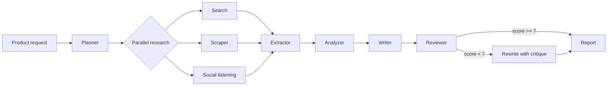

<div align="center">
  

  <h1>PM Agent Team</h1>

  <p><a href="README.md">English</a> | <a href="README.zh-CN.md">简体中文</a></p>

  <p><strong>A multi-agent research automation platform for product managers</strong></p>

  <p>Competitive research · Interview analysis · PRD drafting · Social listening</p>

  
</div>

## Why it exists

Product managers spend a large amount of time on research workflows that are structurally repetitive but information-heavy. PM Agent Team turns those workflows into multi-agent pipelines that search, extract, analyze, write, review, and revise structured reports with citations.

| Workflow | What the system produces |
| --- | --- |
| Competitive research | Market scan, product matrix, SWOT, user sentiment, and cited report |
| Interview analysis | Theme clustering, frequency analysis, source quotes, and confidence-ranked needs |
| PRD drafting | Background, goals, user stories, acceptance criteria, and risks |
| Social listening | Cross-platform posts, relevance filtering, clusters, and opportunity insights |

## What makes it more than a single LLM call

- **Parallel agent pipeline** — planning, search, crawling, social listening, extraction, analysis, writing, and review.
- **Self-correction loop** — low review scores send critique back to the writer for one revision pass.
- **Eleven expert roles** — research, market intelligence, lean validation, risk review, and other specialists are selected by scenario.
- **Project memory** — related tasks share a project space and can recall prior research.
- **Incremental follow-ups** — a follow-up becomes a child task and merges back into the parent report.
- **Cost observability** — token and cost attribution by task, agent, and model with an optional budget cap.
- **Failure recovery** — exponential LLM retry and non-blocking optional agents.
- **Slack and Jira integration** — send report cards, create issues, or trigger PRD drafting from Jira webhooks.

## Interface


The React interface includes a workflow dashboard, scenario pages, task lists, a live agent timeline, report previews, review scores, follow-up controls, and social-post exploration.

## Architecture


```mermaid
flowchart LR
    U[Product request] --> P[Planner]
    P --> R{Parallel research}
    R --> S1[Search]
    R --> S2[Scraper]
    R --> S3[Social listening]
    S1 & S2 & S3 --> E[Extractor]
    E --> A[Analyzer]
    A --> W[Writer]
    W --> RV[Reviewer]
    RV -->|score >= 7| OUT[Report]
    RV -->|score < 7| W2[Rewrite with critique]
    W2 --> OUT
```

The backend is a Go HTTP/SSE service with an in-memory worker queue and store. The frontend is React 18, Vite, TypeScript, React Router, and Tailwind CSS. PostgreSQL/pgvector migrations are included as a future production path, while the default development setup works without them.

## Quick start

### 1. Clone and configure

```bash
git clone https://github.com/realruian/PM_Agent_Team.git
cd PM_Agent_Team
cp .env.example .env
```

Add a supported LLM provider key to `.env`. With no key, the application falls back to mock mode so the UI and pipeline can still be explored.

### 2. Start the backend

Requires Go 1.26.2.

```bash
set -a && source .env && set +a
cd server
go run ./cmd/server
```

The API listens on `http://localhost:8080` by default.

### 3. Start the frontend

```bash
cd web
npm install
npm run dev
```

Open `http://localhost:5173`.

## Main scenarios

- `requirement_analysis`
- `competitor_research`
- `requirement_validation`
- `interview_analysis`
- `prd_drafting`
- `social_listening`

Tasks stream agent activity over SSE and expose the final report, sources, review metadata, social posts, traces, and usage data through the API.

## Configuration

See [`.env.example`](.env.example) for the complete list.

| Variable | Purpose |
| --- | --- |
| `LLM_PROVIDER`, `LLM_MODEL`, `LLM_BASE_URL` | Model provider and optional custom gateway |
| Provider API keys | Configure one provider; no key enables mock mode |
| `MOCK_MODE` | `auto`, `always`, or `never` |
| `TASK_BUDGET_USD` | Per-task model budget |
| `SEARCH_PROVIDER` | Search routing; Tavily and Jina keys are optional |
| `SLACK_WEBHOOK_URL` | Slack notifications |
| Jira variables | Jira REST and webhook integration |
| Social credentials | Optional X, Douyin, TikTok, or YouTube access |
| `HTTP_ADDR`, `CORS_ORIGINS` | HTTP listener and allowed frontend origins |

## Repository layout

```text
server/              Go API, agents, LLM adapters, tools, store, jobs, and SSE
web/                 React dashboard and workflow pages
assets/              Logo, banner, screenshots, and interactive architecture
docs/                Data-pipeline design notes
docker-compose.yml   PostgreSQL and pgvector production path
.env.example         Configuration template
```

## Verification

```bash
cd server && go test ./... -race
cd web && npm install && npm run build
```

## Roadmap

Planned work includes pgvector-backed memory and evaluation, multimodal input, team review workflows, scheduled industry data ingestion, and a public beta.

## License

[MIT](LICENSE) · PM Agent Team v0.6
